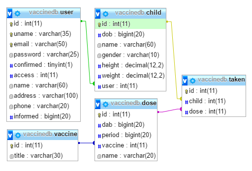

# VaccineForChild     
**Database cource project.**    
*Shahjalal University of Science and Technology.*     

## 1) General Information      

#### 1.1 Purpose     
Design a Database System to notify parents about the schedule to vaccinate their children.  

#### 1.2 Problem Statement    
To keep a child healthy and secure from future risks of deadly diseases, a proper vaccination schedule should be maintained. But many parents do not know about the schedule or they forget about it and consequently their child becomes vulnerable to diseases. To prevent child-death solely for this reason, a system should be placed to notify the parents prior to vaccination schedule by mobile SMS or in other ways.     

#### 1.3 Solution Statement    
To design a Database System that will:     

* Provide a website to register a child for vaccination notification.   
* View and edit information about the child and upcoming vaccination schedules.   
* Send messages to mobile phones of the parents. Message could be send to more than one number for a child.   
* Check in after the vaccination is done for future reference.   
* For health care center and doctors show reports about how many children needs to be vaccinated and how many has done regular vaccination.    
* Notify child care center if a child does not get vaccine in time or any irregularities.   

#### 1.4 System Overview    

* Back-End: Jade, NodeJS Express 4.13.1
* Front-End: HTML 5.0, CSS 3.0, Bootstrap 3.3.6, AngularJS 1.4.8
* Targeted platform: Cross platform   
* Testing: XAMPP in windows 32bit   

#### 1.5 Database Overview

* Engine: MySQL    
* Database: VaccineDB    
* Database Design: [Pony ORM Editor : VaccineDB](https://editor.ponyorm.com/user/sdipu/VaccineDB)     
* Database Schema: [Database SQL](_database/db.sql)   

#### 1.6 Developers
 
* [Sudipto Chandra Das Dipu](https://github.com/dipu-bd)   
*Registration No*: 2012331019   
* [Bishwajit Purkaystha](https://github.com/bishwa420)      
*Registration No*: 2012331013    

#### 1.7 Supervisor 

* **Mr. Biswapriyo Chakrabarty**    
**Lecturer**, *Department of Computer Science and Engineering*, Shahjalal University of Science and Technology.    
   
   
## 2) Database Diagram

#### 2.1 E-R Diagram    

